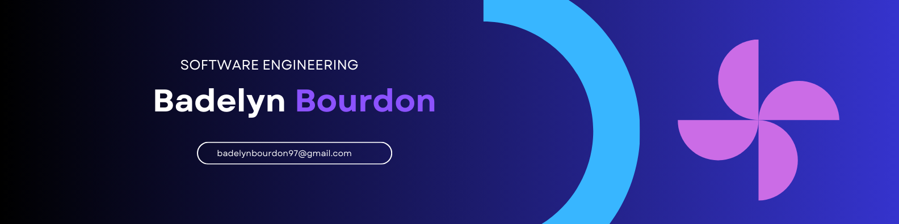

 

  
  <h1>Welcome Hello Word</h1>

 🌟 Hola, soy Badelyn. Soy estudiante de informática y apasionada por el desarrollo de aplicaciones, los idiomas y el emprendimiento.

💡 Actualmente estoy trabajando en:
- Proyectos de bases de datos 
- Aplicaciones web simples 
- Mi marca personal e ideas de negocio 

<h1> Comunidades</h1>

 

<h1> Tecnologias</h1>

